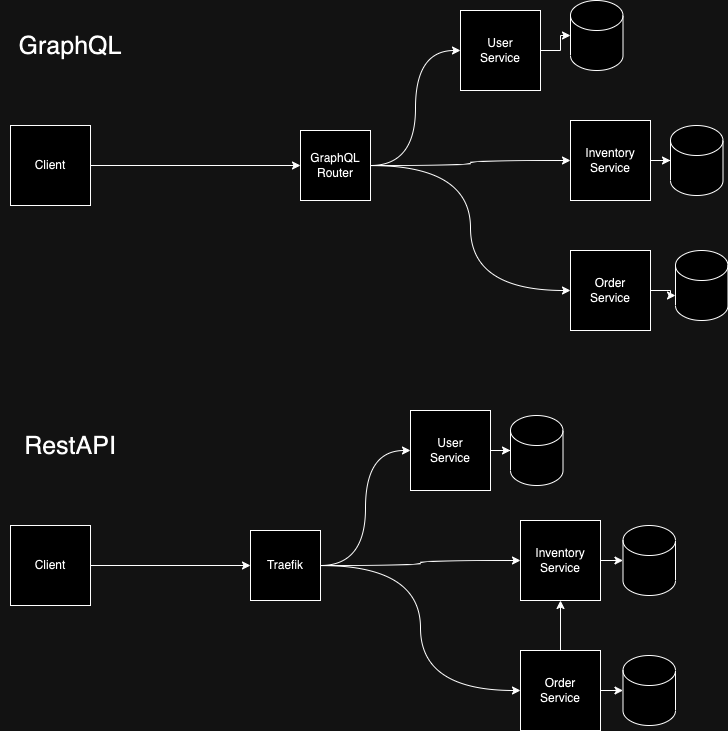

Books Inventory
================

This is a simple books inventory application. It is a web backed to order books from an inventory

## Notes
* This application has two modes: GraphQL (preferred) and REST API
  * To run this application:
    ```bash
    $ docker compose -f docker-compose.graphql.yml up -d
    $ docker compose -f docker-compose.rest.yml up -d
    ``` 
    For graphql you can go to http://localhost:4000 and use the graphql playground
    For Rest use http://localhost:4000 and insomina, postman or any other rest client
* There are three microservices. In the Graphql version, there is true separation as Order service does not need to
  know anything about Inventory service to provide `books` on the same query. In the REST API version, the Order service
  must know about the Inventory service to provide the `books` on the order response as it needs to call the inventory 
  service internally.
* All microservices have their own databases. This is to avoid coupling between services. Services should be able to
  manage themeselves and evolve independently.
* You will noticed I pass context through every function, this is to enable usage for other libraries such as for 
  metrics and tracing which gets passed on usually through context. Additionally some libraries my require this to
  pass context so it can pass it back to the parent service. ex: [mfa-lib](https://github.com/honestbank/mfa-lib)
* Both Graphql and Rest use HTTP for communication between services. Due to this we can have the same middlewares and
  reuse such as authentication or transformation of data.
* Missing test coverage in order service as there was not a lot of time left.

## GraphQL

You can see the schema by either running the application and going to http://localhost:4000 or by looking at the
`sdl.graphql` file. (gateway/sdl.graphql). gqlgen is used to generate boilerplate code for the graphql server.

## REST API

In each microservice there is a folder `/http/htt_routes` and a function `RegisterRoutes` that registers the routes. 
Use this to figure out the routes for the microservices. Microservices are proxied through Traefik to allow easy usage
at a single url.
ex:
  `/api/user/*` -> `http://user-api:3000/api/user/*`
  `/api/orders/*` -> `http://order-api:3000/api/orders/*`
  `/api/inventory/*` -> `http://inventory-api:3000/api/inventory/*`

To make maters more simple, the RestAPI reuses the same resolvers that Graphql uses saving me time from recreating the
same structs for the rest api. Some modifications are required such as with the `/api/orders/{id}` and 
`/api/orders/user/{id}` which return an extended type (order type extended with `books` field). In RestAPI the order
service must call the inventory service to get the books for the order. In Graphql, the order service does not need to
call the inventory service as it can be done in the same query and the apollo router will handle this for you.

## How to run:
```bash
$ docker compose -f docker-compose.graphql.yml up -d
```
or
```bash
$ docker compose -f docker-compose.rest.yml up -d
```

You cannot run both at once as they will conflict with each other.

Each microservice can be run individually by going into the microservice folder and running:
```bash
$ go run cmd/main.go serve graphql
```

```bash
$ go run cmd/main.go serve http
```

## Testing

There have mainly been unit tests done. In terms of integration tests, the repositories require a database to be running
and use transactions to run tests (so we dont write the db). For integration theres there was just not enough time to
get it all done. Typically I would use github.com/testcontainers/testcontainers-go for testing integration tests. Whats
nice about this is that you can run your tests in go not needing to run something on postman, PAW, or the like. This
gives more felxibility for you to test things like service errors (you can spin down the container to simulate a service
failure). Additionally, you can run the tests in a CI/CD pipeline and have it run the tests for you. 


## Initial improvements that could be done

Since there was not enough time to come up with the most optimal solution, here are some improvements that could be
done:

* Inventory could be more generic
  * Purpose of inventory holding types of products would give flexibilty to add other products other than books.
  * More supportive functions for batch operations. Currently everything handles as one which can slow down performance
    ex: say you order 500 books, to get this order you need to call the inventory service 500 times. Graphql has a
    solution for this called dataloaders which can batch these calls for you.
* idempotency
  * This is a big one. Idempotency is important for any service that is exposed to the public. This is to avoid
    duplicate orders. This can be done by adding a unique id to the order and checking if it exists before creating
    the order. This can be done by adding a unique id to the order and checking if it exists before creating the order.
    This can be done by adding a unique id to the order and checking if it exists before creating the order.
  * An easy way to fix is to provide a unique idempotency key in the request header. This can be used to check if the
    order has already been created. If it has, then return the order (from cache). If not, then create the order.

## Seeding

Seeding is done automatically. Just pulls a script from the seed directory and runs. 
```bash
$ go run cmd/main.go migrate seed
```

### Diagram



## CI/CD

Normally I would create CI/CD. You can look here (https://github.com/weeb-vip/anime-api) for an example of how I would
do CI/CD albeit it does not have tests, it does have automation setup for auto deployments. If you would like an example
with tests you can look here: https://github.com/bludot/ac-backend.

### Missing features:

[ ] JWT verification (no authentication in headers)
